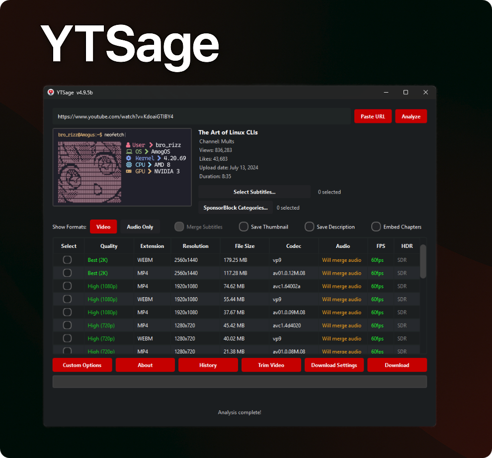
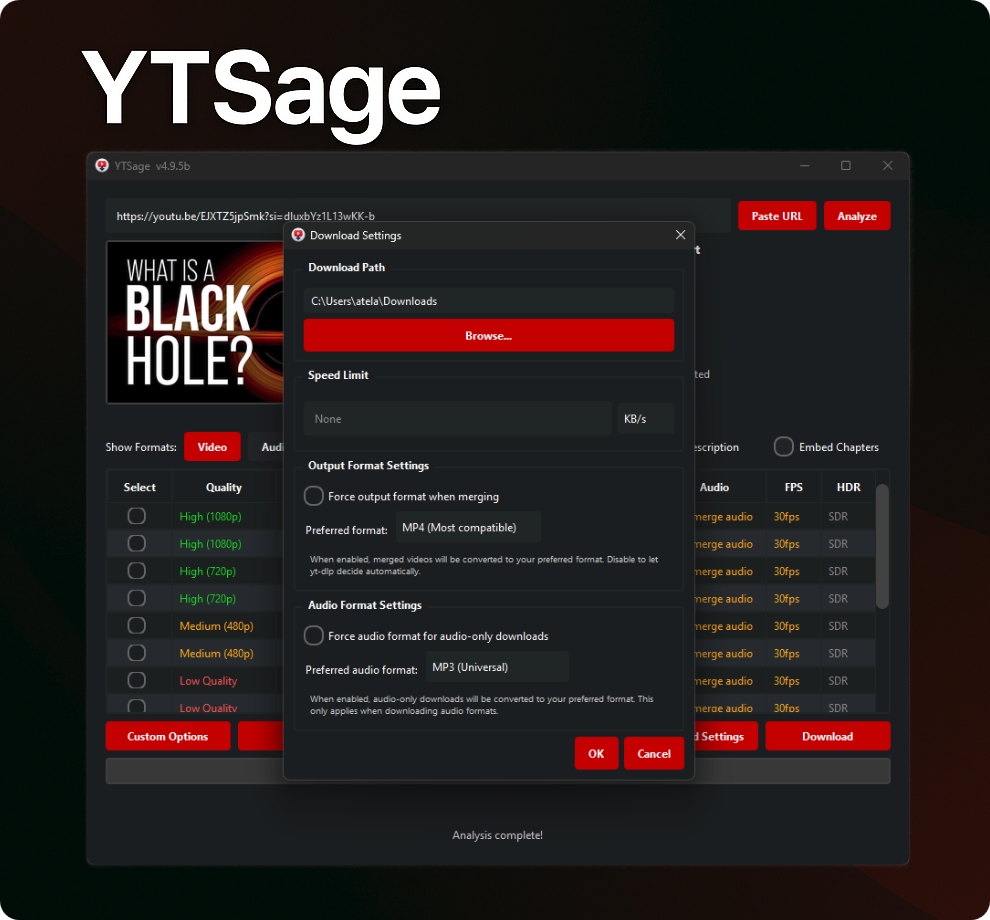

<div align="center">




[](https://www.python.org/downloads/)
[](https://pepy.tech/project/sage-dlp)
[](https://github.com/oop7/SageDLP/releases)
[](https://opensource.org/licenses/MIT)
[](https://github.com/oop7/SageDLP/releases)
[](https://github.com/oop7/SageDLP/stargazers)
[](https://pypi.org/project/sage-dlp/)
[](https://github.com/sponsors/oop7)

**Ein moderner YouTube-Downloader mit einer eleganten PySide6-Benutzeroberfläche.**  
Downloaden Sie Videos in jeder Qualität, extrahieren Sie Audio, rufen Sie Untertitel ab und vieles mehr.

### 🌍 README-Sprachen

Englisch: [EN](../README.md)
| Arabisch: [AR](README.ar.md)
| Deutsch: [DE](README.de.md)
| Spanisch: [ES](README.es.md)
| Französisch: [FR](README.fr.md)
| Hindi: [HI](README.hi.md)
| Indonesisch: [ID](README.id.md)
| Italienisch: [IT](README.it.md)
| Japanisch: [JA](README.ja.md)
| Polnisch: [PL](README.pl.md)
| Portugiesisch: [PT](README.pt.md)
| Russisch: [RU](README.ru.md)
| Türkisch: [TR](README.tr.md)
| Chinesisch: [ZH](README.zh.md)

<p align="center">
  <a href="#installation">Installation</a> •
  <a href="#features">Funktionen</a> •
  <a href="#usage">Bedienung</a> •
  <a href="#screenshots">Screenshots</a> •
  <a href="#troubleshooting">Fehlerbehebung</a> •
  <a href="#sponsor">Sponsoren</a> •
  <a href="#contributing">Mitwirken</a>
</p>

</div>

---

<a id="why-sage-dlp"></a>
## ❓ Warum SageDLP?

SageDLP wurde für Benutzer entwickelt, die einen **einfachen, aber leistungsstarken YouTube-Downloader** suchen. Im Gegensatz zu anderen Tools bietet es:

- Eine moderne und übersichtliche PySide6-Oberfläche
- Ein-Klick-Downloads für Video, Audio und Untertitel
- Erweiterte Funktionen wie SponsorBlock, Zusammenführen von Untertiteln und Playlist-Auswahl
- Optionaler generischer Modus (Generic Mode) für von yt-dlp unterstützte Seiten außerhalb von YouTube
- Plattformübergreifende Unterstützung und einfache Installation

<a id="features"></a>
## ✨ Funktionen

<div align="center">

| Basisfunktionen | Erweiterte Funktionen | Zusätzliche Funktionen |
|-----------------------------------|-----------------------------------------|------------------------------------|
| 🎥 Formattabelle | 🚫 SponsorBlock-Integration | 🎞️ FPS/HDR-Anzeige |
| 🎵 Audio-Extraktion | 📝 Untertitel-Auswahl & Merging | 🔄 Automatisches yt-dlp Update |
| ✨ Einfache Benutzeroberfläche | 💾 Beschreibung & Thumbnail speichern | 🛠️ FFmpeg/yt-dlp/Deno Erkennung |
| 📋 Playlist-Support & Selector | 🚀 Geschwindigkeitsbegrenzer | ⚙️ Benutzerdefinierte Befehle |
| 📑 Kapitel-Integration | ✂️ Videoabschnitte zuschneiden | 🍪 Cookie-Login |
| 📜 Download-Historie | 🔄 Release-Kanal Auswahl | 🌐 Proxy-Support |
| 🎚️ Audioformat-Konvertierung | 🎬 Videoformat-Einstellungen | 🆙 Integrierter Update-Tab |
| 🌍 Generischer Modus | 🔊 Audio-Normalisierung (EBU R128) | 🌍 In 14 Sprachen lokalisiert |
| 💾 Playlist-Export | ⚙️ Standardqualität & Untertitel | |
</div>

<a id="installation"></a>
## 🚀 Installation

### ⚡ Schnelle Installation (Empfohlen)

Installieren Sie SageDLP über PyPI:

```bash
pip install sage-dlp
```

<details>
<summary>🔄 Bestehende Installation aktualisieren</summary>

```bash
pip install --upgrade sage-dlp
```

</details>

Starten Sie dann die Anwendung:

```bash
sage-dlp
```

### 📦 Vorgefertigte ausführbare Dateien

> [👉 Neuestes Release herunterladen](https://github.com/oop7/SageDLP/releases/latest)

#### 🪟 Windows

| Format | Beschreibung |
|--------|-------------|
|  | Standard-Installer |
|  | Mit integriertem FFmpeg |
|  | Portable Version, keine Installation erforderlich |
|  | Portable Version mit FFmpeg, gepackt |

<details>
<summary>🛠️ Installationsschritte</summary>

1. **EXE-Installer (`.exe`)**: Doppelklicken Sie auf die Datei und folgen Sie dem Installationsassistenten.
2. **Portable Version (`.zip`)**: Entpacken Sie das Archiv an den gewünschten Ort und starten Sie `sage-dlp.exe`.
3. **Integriertes FFmpeg**: Wählen Sie die Versionen mit integriertem FFmpeg, falls FFmpeg nicht bereits auf Ihrem System installiert ist.
</details>

#### 🐧 Linux

| Format | Beschreibung |
|--------|-------------|
|  | Debian-Paket |
|  | AppImage, portabel |
|  | RPM-Paket |
|  | Flatpak Bundle |

<details>
<summary>🛠️ Installationsschritte</summary>

- **DEB (`.deb`)**:
  ```bash
  sudo dpkg -i sage-dlp_*.deb
  sudo apt-get install -f # Repariert fehlende Abhängigkeiten, falls nötig
  ```
- **RPM (`.rpm`)**:
  ```bash
  sudo rpm -i sage-dlp-*.rpm
  ```
- **AppImage (`.AppImage`)**:
  ```bash
  chmod +x SageDLP-*.AppImage
  ./SageDLP-*.AppImage
  ```
- **Flatpak**: Folgen Sie den Anweisungen auf Flathub oder führen Sie aus:
  ```bash
  flatpak install flathub io.github.oop7.sage-dlp
  ```
</details>

#### 🍎 macOS

| Format | Beschreibung |
|--------|-------------|
|  | Gepackte App für Apple Silicon |
|  | Disk Image Installer für Apple Silicon |

<details>
<summary>🛠️ Installationsschritte</summary>

- **DMG-Installer (`.dmg`)**: Doppelklick zum Mounten, dann `SageDLP.app` in den Programme-Ordner ziehen.
- **App-Archiv (`.zip`)**: Zip entpacken und `SageDLP.app` in den Programme-Ordner verschieben.

*Hinweis: Wenn Sie die Fehlermeldung "App ist beschädigt" erhalten, lesen Sie bitte den Abschnitt zur Fehlerbehebung für macOS weiter unten.*
</details>

---

<details>
<summary>💻 Manuelle Installation aus dem Quellcode</summary>

### 1. Repository klonen

```bash
git clone https://github.com/oop7/SageDLP.git
cd SageDLP
```

### 2. Abhängigkeiten installieren

#### ⚡ Mit uv

```bash
uv pip install .
```

#### 📦 Oder mit Standard-pip

```bash
pip install .
```

### 3. Anwendung starten

```bash
python -m sage-dlp.main
```

</details>

<a id="screenshots"></a>
## 📸 Screenshots

<div align="center">
<table>
  <tr>
    <td></td>
    <td></td>
  </tr>
  <tr>
    <td align="center"><em>Download-Einstellungen</em></td>
    <td align="center"><em>Playlist-Download</em></td>
  </tr>
  <tr>
    <td></td>
    <td></td>
  </tr>
  <tr>
    <td align="center"><em>Audioformat</em></td>
    <td align="center"><em>Benutzerdefinierte Optionen</em></td>
  </tr>
</table>
</div>

<a id="usage"></a>
## 📖 Bedienung

<details>
<summary>🎯 Grundlegende Bedienung</summary>

1. **SageDLP starten**
2. **YouTube-URL einfügen** (oder die Schaltfläche "Paste URL" verwenden)
3. **Auf "Analyze" klicken**
4. **Format auswählen:**
   - `Video` für Video-Downloads
   - `Audio Only` für Audio-Extraktion
5. **Optionen wählen:**
   - Untertitel aktivieren & Sprache auswählen
   - Untertitel-Merging aktivieren
   - Thumbnail speichern
   - Sponsoren-Segmente entfernen
   - Beschreibung speichern
   - Kapitel integrieren
6. **Ausgabeverzeichnis wählen**
7. **Auf "Download" klicken**

> 💡 Das Standard-Download-Verzeichnis ist der "Downloads"-Ordner des Benutzers.

</details>

<details>
<summary>📋 Playlist-Download</summary>

1. **Playlist-URL einfügen**
2. **Auf "Analyze" klicken**
3. **Videos aus dem Playlist-Selector auswählen (optional, standardmäßig alle)**
4. **Gewünschtes Format/Qualität wählen**
5. **Auf "Download" klicken**

> 💡 Die Anwendung verwaltet die Download-Warteschlange automatisch, und Sie können Playlist-Einträge als `.txt`, `.csv`, `.m3u` oder `.json` exportieren.

</details>

<details>
<summary>🌍 Generischer Modus für Nicht-YouTube-Seiten</summary>

Verwenden Sie den generischen Modus (Generic Mode), wenn SageDLP URLs von anderen von yt-dlp unterstützten Seiten wie Dailymotion, CBC Gem, TikTok und anderen akzeptieren soll.

So verwenden Sie ihn:

1. Öffnen Sie `Download Settings`.
2. Aktivieren Sie `Generic Mode`.
3. Fügen Sie eine unterstützte Video- oder Playlist-URL ein, die nicht von YouTube stammt.
4. Klicken Sie auf `Analyze`.
5. Wählen Sie ein Format und laden Sie es wie gewohnt herunter.

Hinweise:

- Der generische Modus ändert nur die URL-Validierung innerhalb von SageDLP. Die Zielseite muss weiterhin von Ihrer installierten yt-dlp-Version unterstützt werden.
- Einige Seiten erfordern Cookies, Login, Proxy oder zusätzliche yt-dlp-Argumente je nach Extractor.
- Wenn eine Seite fehlschlägt, aktualisieren Sie zuerst yt-dlp über den integrierten Update-Tab, bevor Sie das Problem melden.

</details>

<details>
<summary>🧰 Medien- & Download-Optionen</summary>

- **Untertitel-Optionen:** Sprachen filtern und Untertitel in die Videodatei einbetten.
- **Untertitel-Merging:** Mergt Untertitel in die Videodatei für fest eingebrannte (hardcoded) Untertitel.
- **Beschreibung speichern:** Speichert die Videobeschreibung als Textdatei.
- **Thumbnail speichern:** Speichert das Video-Thumbnail als Bilddatei.
- **Kapitel integrieren:** Bettet Kapitelmarken als Metadaten für kompatible Videoplayer ein.
- **Sponsoren-Segmente entfernen:** Entfernt gesponserte Abschnitte aus dem Video mithilfe von SponsorBlock.
- **Video zuschneiden:** Laden Sie nur bestimmte Teile eines Videos herunter, indem Sie Zeitbereiche im Format `HH:MM:SS` angeben.

</details>

<details>
<summary>⚙️ Ausgabe- & Dateieinstellungen</summary>

- **Geschwindigkeitsbegrenzer:** Begrenzt die Download-Geschwindigkeit, z. B. `500K` für 500 KB/s.
- **Download-Pfad speichern:** Speichert den Standard-Download-Pfad für zukünftige Downloads. Verfügbar unter **Download Settings → Download Path**.
- **Standard-Videoauflösung:** Legen Sie Ihre bevorzugte Videoauflösung für die automatische Auswahl fest (z. B. 1080p, 720p). Verfügbar unter **Download Settings → Default Video Resolution**.
- **Standard-Untertitelsprachen:** Legen Sie Standard-Untertitelsprachen für die automatische Auswahl fest (kommagetrennt, z. B. `de,en`). Verfügbar unter **Download Settings → Default Subtitle Languages**.
- **Dateinamen-Format:** Passen Sie das Format des Ausgabedateinamen mit Variablen wie `%(title)s`, `%(uploader)s`, `%(playlist_index)s` und `%(resolution)s` an. Verfügbar unter **Download Settings → Filename Format**.
- **Ausgabeformat erzwingen:** Erzwingt Video-Downloads in ein bestimmtes Containerformat wie `mp4`, `webm` oder `mkv`. Verfügbar unter **Download Settings → Output Format Settings**.
- **Audioformat-Konvertierung:** Konvertiert reine Audio-Downloads in bevorzugte Formate wie `AAC`, `MP3`, `FLAC`, `WAV`, `Opus`, `M4A`, `Vorbis` oder `Best`. Verfügbar unter **Download Settings → Audio Format Settings**.
- **Audio-Normalisierung:** Standardisiert die Lautstärke für reine Audio-Downloads unter Verwendung von EBU R128.
- **Gleichzeitige Verbindungen:** Erhöhen Sie die Download-Geschwindigkeit erheblich, indem Sie Dateien in mehreren Fragmenten gleichzeitig herunterladen. Verfügbar unter **Download Settings → General → Concurrent Connections** (Standardmäßig 1, maximal 8-10 empfohlen, um IP-Sperren zu vermeiden).

</details>

<details>
<summary>🌐 Zugriff & Netzwerk</summary>

- **Cookie-Login:** Loggen Sie sich mit Cookies bei YouTube ein, um auf private Inhalte zuzugreifen.
  Verwendung:
  1. **Empfohlen:** Verwenden Sie die integrierte Option `Extract cookies from browser` in der App, wählen Sie dann Ihren Browser und optional ein Profil.
  2. Alternativ können Sie Cookies manuell extrahieren:
     a. Exportieren Sie Cookies aus Ihrem Browser mit einer Erweiterung wie [cookie-editor](https://github.com/moustachauve/cookie-editor?tab=readme-ov-file)
     b. Kopieren Sie die Cookies im Netscape-Format
     c. Erstellen Sie eine Datei namens `cookies.txt` und fügen Sie die Cookies ein
     d. Wählen Sie die Datei `cookies.txt` in der App aus
- **Proxy-Support:** Verwenden Sie einen Proxy-Server für Downloads, z. B. `http://<proxy-server>:<port>`
- **Generischer Modus:** Ermöglicht SageDLP das Analysieren und Herunterladen von anderen von yt-dlp unterstützten Seiten. Aktivieren Sie dies unter **Download Settings → Generic Mode**.

</details>

<details>
<summary>🛠️ Tools & Wartung</summary>

- **Benutzerdefinierte Befehle:** Greifen Sie auf erweiterte yt-dlp-Funktionen über Befehlszeilenargumente zu.
- **Update-Tab:** Verwalten Sie integrierte Update-Tools an einem Ort in den benutzerdefinierten Optionen:
  - **yt-dlp Updates:** Suchen Sie nach Updates und wechseln Sie zwischen Stable- und Nightly-Release-Kanälen.
  - **FFmpeg-Versionsprüfung:** Überprüfen Sie Ihre FFmpeg-Version und öffnen Sie Installationsanleitungen.
  - **Deno-Updates:** Überprüfen und aktualisieren Sie die Deno-Laufzeitumgebung.
- **FFmpeg/yt-dlp/Deno Erkennung:** Erkennt Pfade und Versionen von FFmpeg, yt-dlp und Deno automatisch aus dem About-Dialog.
- **Download-Historie:** Zeigt vergangene Downloads mit Thumbnails und Status über die Schaltfläche **History** an.

</details>

<details>
<summary>🌍 Lokalisierung</summary>

SageDLP unterstützt **14 Sprachen** für globale Barrierefreiheit. Wählen Sie Ihre bevorzugte Sprache unter **Custom Options → Language**.

### Unterstützte Sprachen

| Sprache | Code | Sprache | Code |
|----------|------|----------|------|
| 🇺🇸 Englisch | `en` | 🇪🇸 Spanisch | `es` |
| 🇸🇦 Arabisch | `ar` | 🇫🇷 Französisch | `fr` |
| 🇩🇪 Deutsch | `de` | 🇮🇳 Hindi | `hi` |
| 🇮🇩 Indonesisch | `id` | 🇮🇹 Italienisch | `it` |
| 🇯🇵 Japanisch | `ja` | 🇵🇱 Polnisch | `pl` |
| 🇧🇷 Portugiesisch | `pt` | 🇷🇺 Russisch | `ru` |
| 🇹🇷 Türkisch | `tr` | 🇨🇳 Chinesisch | `zh` |

### README-Übersetzungen

| Sprache | Datei | Sprache | Datei |
|----------|------|----------|------|
| 🇺🇸 Englisch | [README.md](../README.md) | 🇪🇸 Spanisch | [README.es.md](README.es.md) |
| 🇸🇦 Arabisch | [README.ar.md](README.ar.md) | 🇫🇷 Französisch | [README.fr.md](README.fr.md) |
| 🇩🇪 Deutsch | [README.de.md](README.de.md) | 🇮🇳 Hindi | [README.hi.md](README.hi.md) |
| 🇮🇩 Indonesisch | [README.id.md](README.id.md) | 🇮🇹 Italienisch | [README.it.md](README.it.md) |
| 🇯🇵 Japanisch | [README.ja.md](README.ja.md) | 🇵🇱 Polnisch | [README.pl.md](README.pl.md) |
| 🇧🇷 Portugiesisch | [README.pt.md](README.pt.md) | 🇷🇺 Russisch | [README.ru.md](README.ru.md) |
| 🇹🇷 Türkisch | [README.tr.md](README.tr.md) | 🇨🇳 Chinesisch | [README.zh.md](README.zh.md) |

> 💡 **Möchten Sie bei einer Übersetzung helfen?** Schauen Sie in den Abschnitt [Mitwirken](#contributing), um uns zu helfen, weitere Sprachen hinzuzufügen!

</details>

<a id="troubleshooting"></a>
## 🛠️ Fehlerbehebung

<details>
<summary>Klicken Sie hier, um häufige Probleme und Lösungen anzuzeigen</summary>

- **Formattabelle wird nicht angezeigt:** Aktualisieren Sie yt-dlp auf die neueste Version und wechseln Sie zu yt-dlp nightly.
- **Download schlägt fehl:** Überprüfen Sie Ihre Internetverbindung und stellen Sie sicher, dass das Video verfügbar ist.
- **Spezifische Download-Fehler:**
  - **Private Videos:** Verwenden Sie Cookie-Authentifizierung, um auf private Inhalte zuzugreifen.
  - **Videos mit Altersbeschränkung:** Loggen Sie sich in Ihr YouTube-Konto ein, um altersbeschränkte Videos anzusehen.
  - **Geoblockierte Videos:** Erwägen Sie die Verwendung eines VPN, um regionale Einschränkungen zu umgehen.
  - **Gelöschte Videos:** Das Video ist auf YouTube nicht mehr verfügbar.
  - **Livestreams:** Livestreams können während der Übertragung nicht heruntergeladen werden; warten Sie, bis der Stream beendet ist.
  - **Netzwerkfehler:** Überprüfen Sie Ihre Internetverbindung und versuchen Sie es erneut.
  - **Ungültige URLs:** Stellen Sie sicher, dass die URL korrekt ist und von einer unterstützten Plattform stammt.
  - **Premium-Inhalte:** Erfordert ein YouTube-Premium-Abonnement.
  - **Urheberrechtssperren:** Der Inhalt ist aufgrund von Urheberrechtsbeschränkungen gesperrt.
- **Video- und Audiodateien sind nach dem Download getrennt:** Dies passiert, wenn FFmpeg fehlt oder nicht erkannt wird. SageDLP benötigt FFmpeg, um hochwertige Video- und Audiostreams zusammenzuführen.
  - **Lösung:** Stellen Sie sicher, dass FFmpeg installiert und im PATH Ihres Systems zugänglich ist. Für Windows-Benutzer ist die einfachste Option, die Datei `SageDLP-v<version>-ffmpeg.exe` herunterzuladen, die FFmpeg integriert hat.

---

#### 🛡️ Windows Defender / Antivirus Warnung

Einige Antivirenprogramme können `.exe`-Dateien als Fehlalarm (False Positive) markieren. Dies ist eine **bekannte Einschränkung** von gepackten Anwendungen.

**Warum das passiert:**
- Antiviren-Heuristiken können gepackte ausführbare Dateien fälschlicherweise als verdächtig identifizieren.

**Sichere Alternativen:**
- ✅ **Verwenden Sie die pip-Installation:** `pip install sage-dlp` (Empfohlen)
- ✅ **Aus dem Quellcode bauen**: Folgen Sie diesem [Leitfaden](../.github/CI_CD_README.md)
- ✅ **App auf die Whitelist setzen** in Ihrer Antiviren-Software.

#### 🍎 macOS: "Die App ist beschädigt und kann nicht geöffnet werden"
Wenn dieser Fehler unter macOS Sonoma oder neuer auftritt, müssen Sie das Quarantäne-Attribut entfernen.

1.  **Öffnen Sie das Terminal** (Sie finden es über Spotlight).
2.  **Geben Sie den folgenden Befehl ein**, aber drücken Sie noch **nicht** Enter. Stellen Sie sicher, dass am Ende ein Leerzeichen steht:
    ```bash
    xattr -d com.apple.quarantine 
    ```
3.  **Ziehen Sie die Datei `SageDLP.app`** aus Ihrem Finder-Fenster direkt in das Terminal-Fenster. Dadurch wird der korrekte Dateipfad automatisch eingefügt.
4.  **Drücken Sie Enter**, um den Befehl auszuführen.
5.  **Versuchen Sie erneut, SageDLP.app zu öffnen.** Sie sollte nun korrekt starten.

---

#### **Speicherorte der Konfiguration (Erweitert)**
- **Windows:** `%LOCALAPPDATA%\SageDLP`
- **macOS:** `~/Library/Application Support/SageDLP`
- **Linux:** `~/.local/share/SageDLP`

</details>

<a id="sponsor"></a>
## 💖 Sponsoren

Wenn SageDLP Ihnen Zeit spart, ziehen Sie bitte in Erwägung, das Projekt zu sponsern. Sponsoring hilft, die Entwicklungszeit, Tests auf allen Plattformen und zukünftige Verbesserungen zu finanzieren.

- GitHub Sponsors: https://github.com/sponsors/oop7
- Der Sponsoring-Link ist auch direkt in der App über den About-Dialog verfügbar.

[](https://github.com/sponsors/oop7)

<a id="contributing"></a>
## 👥 Mitwirken

Beiträge sind herzlich willkommen! So können Sie helfen:

1. 🍴 Forken Sie das Repository
2. 🌿 Erstellen Sie einen Feature-Branch:
  ```bash
  git checkout -b feature/AmazingFeature
  ```
3. 💾 Committen Sie Ihre Änderungen:
  ```bash
  git commit -m 'Add some AmazingFeature'
  ```
4. 📤 Pushen Sie in den Branch:
  ```bash
  git push origin feature/AmazingFeature
  ```
5. 🔄 Öffnen Sie einen Pull Request

### 🌍 Zu Übersetzungen beitragen

- Aktualisieren Sie die entsprechende lokalisierte README-Datei (z. B. `readme-translations/README.de.md`)
- Halten Sie die App-Strings synchron, indem Sie `sage-dlp/languages/<code>.json` bearbeiten
- Wenn Ihre Sprache fehlt, beginnen Sie mit der `README.md` und erstellen Sie `README.<code>.md`

<details>
<summary>📂 Projektstruktur</summary>

## SageDLP - Projektstruktur

Dieses Dokument beschreibt die organisierte Ordnerstruktur von SageDLP.

### 📁 Projektstruktur

```
SageDLP/
├── 📁 .github/                   # GitHub-Konfiguration
│   ├── 📁 ISSUE_TEMPLATE/         # Ticket-Vorlagen
│   │   └── 🐛-bug-report.md       # Bug-Report-Vorlage
│   ├─── 📁 workflows/              # GitHub Actions Workflows
│   │   ├── build-linux.yml        # Linux Build Workflow
│   │   ├── build-macos.yml        # macOS Build Workflow
│   │   │── build-windows.yml      # Windows Build Workflow
|   |   └── release-all.yml          # Master Release Workflow
│   └── 📄 CI_CD_README.md        # CI/CD-Dokumentation
├──  📁 branding/                 # Branding-Assets (Screenshots, SVGs)
│   ├── 📁 icons/                 # App-Icons
│   ├── 📁 screenshots/           # Screenshots für die Dokumentation
│   └── 📁 svg/                   # SVG-Assets
├── 📄 LICENSE                    # Lizenzdatei
├── 📄 pyproject.toml             # Projekt-Metadaten und Abhängigkeiten
├── 📄 README.md                  # Projekt-Dokumentation
├── 📄 requirements.txt           # Python-Abhängigkeiten (dev)
└── 📁 sage-dlp/                    # Quellcode-Paket
    ├── 📁 assets/                # Laufzeit-Assets
    │   ├── 📁 Icon/              # App-Icons
    │   └── 📁 sound/             # Audiodateien
    ├── 📁 languages/             # Lokalisierungsdateien
    │   ├── 📄 ar.json            # Arabische Übersetzung
    │   ├── 📄 de.json            # Deutsche Übersetzung
    │   ├── 📄 en.json            # Englische Übersetzung
    │   └── ...                   # Weitere Sprachen
    ├── 📁 core/                  # Hauptgeschäftslogik
    │   ├── 📄 __init__.py        # Core-Paket-Initialisierung
    │   ├── 📄 sage-dlp_deno.py     # Deno-Integration
    │   ├── 📄 sage-dlp_downloader.py # Download-Funktionalität
    │   ├── 📄 sage-dlp_ffmpeg.py   # FFmpeg-Integration
    │   ├── 📄 sage-dlp_utils.py    # Hilfsfunktionen
    │   └── 📄 sage-dlp_yt_dlp.py   # yt-dlp-Integration
    ├── 📁 gui/                   # Benutzeroberflächen-Komponenten
    │   ├── 📄 __init__.py        # GUI-Paket-Initialisierung
    │   ├── 📄 sage-dlp_gui_main.py # Hauptfenster der App
    │   └── 📁 sage-dlp_gui_dialogs/ # Dialog-Klassen
    ├── 📁 utils/                 # Hilfsmodule
    │   ├── 📄 __init__.py        # Utils-Paket-Initialisierung
    │   ├── 📄 sage-dlp_config_manager.py # Konfigurationsverwaltung
    │   └── 📄 sage-dlp_logger.py   # Logging-Tool
    ├── 📄 __init__.py            # Paket-Einstiegspunkt
    └── 📄 main.py                # Hauptskript zur Ausführung
```

</details>

## ⭐️ Star History

<div align="center">

## Star History

<a href="https://www.star-history.com/#oop7/SageDLP&Date">
 <picture>
   <source media="(prefers-color-scheme: dark)" srcset="https://api.star-history.com/svg?repos=oop7/SageDLP&type=Date&theme=dark" />
   <source media="(prefers-color-scheme: light)" srcset="https://api.star-history.com/svg?repos=oop7/SageDLP&type=Date" />
   
 </picture>
</a>

</div>

## 📜 Lizenz

Dieses Projekt steht unter der MIT-Lizenz – weitere Details finden Sie in der Datei [LICENSE](../LICENSE).

## 🙏 Danksagungen

<details>
<summary>Danksagungen anzeigen</summary>

<div align="center">

<p>Ein großes Dankeschön an alle, die zu diesem Projekt beigetragen haben, indem sie Tickets für Verbesserungsvorschläge oder Bug-Reports geöffnet haben.</p>

<table>
    <tr class="section"><th colspan="2">Kernkomponenten</th></tr>
    <tr>
        <td width="35%"><a href="https://github.com/yt-dlp/yt-dlp">yt-dlp</a></td>
        <td>Download-Engine</td>
    </tr>
    <tr>
        <td><a href="https://ffmpeg.org/">FFmpeg</a></td>
        <td>Medienverarbeitung</td>
    </tr>
    <tr>
        <td><a href="https://deno.com/">Deno</a></td>
        <td>Runtime für yt-dlp Integration</td>
    </tr>
    <tr class="section"><th colspan="2">Bibliotheken & Frameworks</th></tr>
    <tr>
        <td><a href="https://wiki.qt.io/Qt_for_Python">PySide6</a></td>
        <td>GUI-Framework</td>
    </tr>
    <tr>
        <td><a href="https://python-pillow.org/">Pillow</a></td>
        <td>Bildverarbeitung</td>
    </tr>
    <tr>
        <td><a href="https://requests.readthedocs.io/">requests</a></td>
        <td>HTTP-Anfragen</td>
    </tr>
    <tr>
        <td><a href="https://packaging.python.org/">packaging</a></td>
        <td>Versionsverwaltung & Packaging</td>
    </tr>
    <tr>
        <td><a href="https://python-markdown.github.io/">markdown</a></td>
        <td>Markdown-Rendering</td>
    </tr>
    <tr>
        <td><a href="https://github.com/Delgan/loguru">loguru</a></td>
        <td>Logging</td>
    </tr>
    <tr class="section"><th colspan="2">Assets & Mitwirkende</th></tr>
    <tr>
        <td><a href="https://pixabay.com/sound-effects/new-notification-09-352705/">New Notification 09 by Universfield</a></td>
        <td>Benachrichtigungston</td>
    </tr>
    <tr>
        <td><a href="https://github.com/viru185">viru185</a></td>
        <td>Code-Contributor</td>
    </tr>
</table>

</div>

</details>

## ⚠️ Haftungsausschluss

Dieses Tool ist nur für den persönlichen Gebrauch bestimmt. Bitte respektieren Sie die Nutzungsbedingungen von YouTube und die Rechte der Content-Ersteller.

---

<div align="center">

Erstellt mit ❤️ von [oop7](https://github.com/oop7)

</div>
